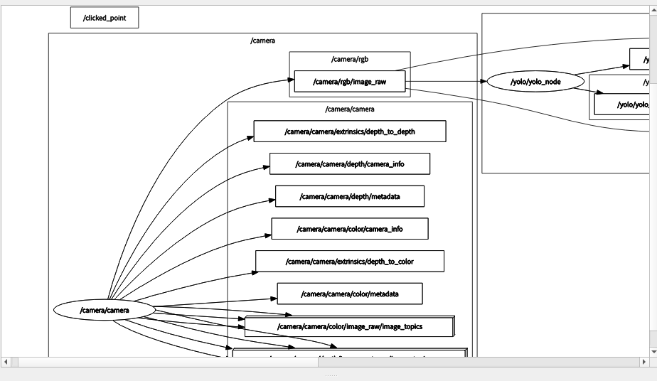
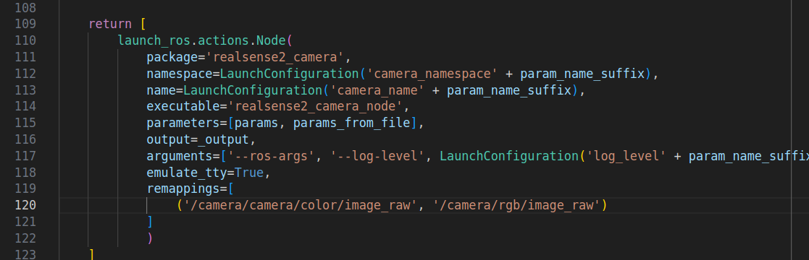

# movement-after-recognition

it uses the yolo model to detect things,from people to chairs to bottles,etc. and will drive the turtlebot3 burger(for example) to move,like going straight,turning left,turning right,etc.

you can define the movement by yourself,just modify the code in src/yolo_move/src/move.cpp

## how to use

0. create a workspace and cd your src.

1. install the yolo model and yolo_ros [here](https://github.com/mgonzs13/yolo_ros)

2. use the camera you like and remap the topic from yours to yolo's.

(Take mine for example, I used the realsense D435i camera, the topic name is `/camera/camera/color/image_raw`, so I remapped it to `/camera/rgb/image_raw` in the launch file)

3. check the needed topic of yolo, and change the topic name in src/yolo_move/src/move.cpp.

4. build the file in your workspace.
`colcon build --symlink-install --cmake-args -DCMAKE_EXPORT_COMPILE_COMMANDS=ON -DCMAKE_BUILD_TYPE=release`

5. open your camera, sourse and launch the file in your terminal.
`ros2 launch yolo_move move.launch.py`

6. you can use rviz2 to see the result and the image from the camera.

7. still, you can change the order of movement in src/yolo_move/src/move.cpp,whatever you like.

8. enjoy it!
